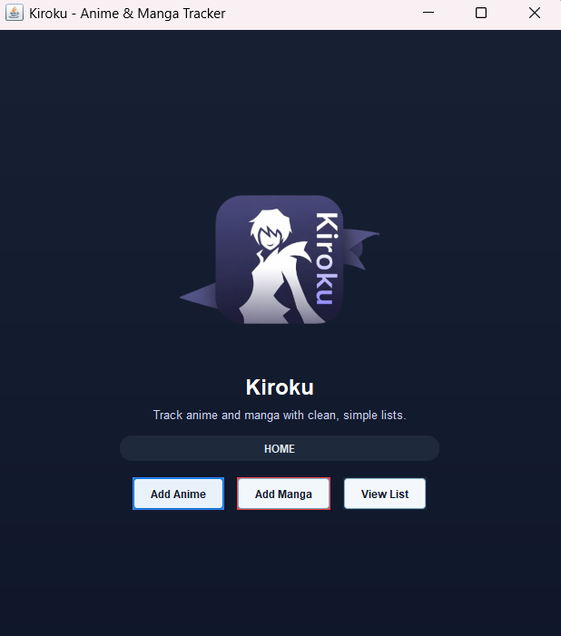

# Kiroku 📖

**Kiroku** is a clean, minimalist desktop application built to track your Anime and Manga progression. Designed with a professional dark-themed aesthetic, it serves as a lightweight, distraction-free alternative to bloated web-based trackers.



## 🚀 Features

* **Dual Tracking**: Separate dedicated sections for Anime (watching) and Manga (reading) to keep your media organized.
* **Modern Interface**: Features a "Kiroku" dark-themed aesthetic using Deep Navy and Slate Grey palettes, inspired by professional UI design principles.
* **Smart Navigation**: Built with `CardLayout` to provide a seamless, non-intrusive navigation experience, allowing you to switch contexts instantly without cluttering the UI.
* **Clean Code Architecture**: Follows a robust 3-class modular structure (`Main`, `AnimeSection`, `MangaSection`) with a centralized `Theme` class for consistent styling and maintainability.

## 🛠️ Technical Stack

* **Language**: Java
* **GUI Framework**: Java Swing & AWT
* **Design Pattern**: Controller-View separation using `CardLayout` and modular class design.

## 🏗️ Project Structure

The project is architected for readability and scalability:

* **`Main.java`**: The primary entry point and Controller. Manages the navigation logic between different app sections using `CardLayout`.
* **`Theme.java`**: A centralized class for color constants (Deep Navy, Slate Grey), ensuring a consistent brand look across the entire application.
* **`AnimeSection.java` / `MangaSection.java`**: Self-contained UI components for specific tracking tasks, utilizing custom card-based layouts for better user experience.

## 💻 How to Run

1. **Prerequisites**: Ensure you have the Java Development Kit (JDK) installed (JDK 17+ recommended).
2. **Clone the Repo**: 
   ```bash
   git clone [https://github.com/yourusername/kiroku.git](https://github.com/yourusername/kiroku.git)
